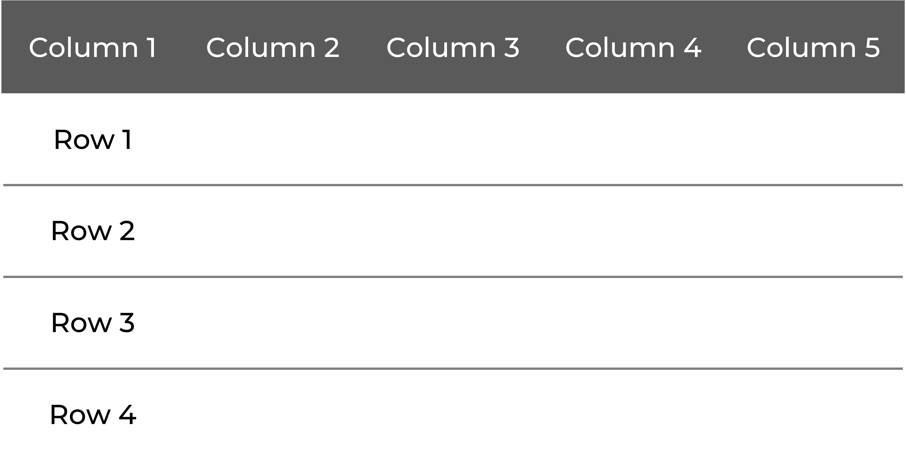

Batch Importing Data Files into the R Environment
================
Ama Nyame-Mensah, Ph.D.

<style type="text/css">
  body{
  font-family: Montserrat;
}

ul.check {
  list-style: none;
}

ul.check li:before {
  content: '✓';
}

</style>

#### Batch Importing Using R

As an avid programmer and data enthusiast, I am often approached with
questions about streamlining data preparation processes. Anyone who
knows me knows that I am an advocate for getting things done with the
least amount of effort. (In some corners of the internet, folks refer to
this as being “effectively lazy.”) It should not come as a surprise then
that I would apply this ethic to my data work.

Not too long ago, I was working on a data analytics project where the
data were stored in multiple files (CSV files to be exact) in a simple
tabular format:



I recently talked to someone about the project, and they wanted to learn
more about my process for importing (or reading) data files into R (my
programming environment of choice). When I asked why they replied,
‘because I import data files one at a time.’

Don’t get me wrong: there is ABSOLUTELY nothing wrong with reading files
this way. But one of the major benefits of programming is that you can
**automate repetitive and tedious tasks**. Naturally, I put on my
educator hat and dedicated an entire blog post to it.

<p style="font-weight:600">
Disclaimer: This post is intended for advanced R users already familiar
with Base R, the Tidyverse, loops, and functions. Some of the concepts
may be unfamiliar if you are new to R. (I may follow up with additional
posts introducing R and its functionalities…Or I will keep posting these
one-offs. Who knows?)
</p>

<br>

#### Reading (Importing) data into R

Ok, so why do we care about reading data into R? Well, most people store
their data on their computer (or a web address or server) in a CSV,
XLSX, or text file (e.g., .TXT, .DAT). Therefore, there is a need to
import that data into a program before any analyses can be performed.
Super fancy folks with a lot of data tend to store their information in
databases. Situations where you have to query a database to extract data
are beyond this article’s scope. However, I encourage all of you to
learn how to pull data from databases. <br><br>

#### Reading a Single Data Set into R

Using R, you can quickly import (i.e., read) data from a wide variety of
file formats. In Base R, you could import the contents of a single CSV
file (with variable names in the first row) using the following function
(be sure to replace **file.location.here** with the location of a data
file.):

<p style="font-weight:600; color:#202020">
Mydata \<- read.csv(“file.location.here.csv”, header = TRUE, sep = “,”)
</p>

I, myself, am partial to the
[**data.table**](https://cran.r-project.org/web/packages/data.table/data.table.pdf)
function
[**fread**](https://www.rdocumentation.org/packages/data.table/versions/1.14.2/topics/fread)
when dealing with large data sets:

<p style="font-weight:600; color:#202020">
Mydata \<- fread(“file.location.here.csv”)
</p>

<br>

#### Reading Multiple Data Sets into R – The Long Way

Let’s say you had four CSV files you wanted to import into your R
environment. You could import these files one-by-one using a function
like
[**fread**](https://www.rdocumentation.org/packages/data.table/versions/1.14.2/topics/fread):

``` r
dat_1 <- fread(file = "sample_dat_1.csv")
dat_2 <- fread(file = "sample_dat_2.csv")
dat_3 <- fread(file = "sample_dat_3.csv")
dat_4 <- fread(file = "sample_dat_4.csv")

ls()
```

    ## [1] "%notin%" "dat_1"   "dat_2"   "dat_3"   "dat_4"   "pckgs"

OR you could import the data sets all at the same time. Below I outline
my three preferred methods. <br><br>

#### Reading Multiple Data Sets into R – The FUN Way!

<p style="text-decoration:underline">
Setting Up Your Environment
</p>
Before importing a batch of files from a directory, several pieces of
information are helpful to know:
<ol>
<li>
Where the data are located;
</li>
<li>
The extension of the data files; and
</li>
<li>
What variable(s) the data frame(s) will be assigned to.
</li>
</ol>

Let’s say you have a folder called **importing files** on your computer
that contains four CSV files titled **sample_dat_1.csv,
sample_dat_2.csv, sample_dat_3.csv, and sample_dat_4.csv**. (Note: These
are generated (fake) data files.) Create a new R Script file in a text
editor (I called my file **importing files.R**), save it to the
importing files folder (with the .R Extension), and open the (script)
file in R.

First, check to make sure you know where the CSV files are. (Given all
files have been saved to the same folder, the list of files of the
working directory will include both the R script file and the CSV
files.)

``` r
list.files()
```

    ##  [1] "batch importing.Rmd"   "batch-importing.md"    "batch-importing.Rmd"  
    ##  [4] "Batch-Importing.Rproj" "importing files.R"     "README.md"            
    ##  [7] "sample_dat_1.csv"      "sample_dat_2.csv"      "sample_dat_3.csv"     
    ## [10] "sample_dat_4.csv"      "table.png"

We only care about the (CSV) data files. To quickly produce a list of
the CSV files, use the
[**list.files()**](https://www.rdocumentation.org/packages/base/versions/3.6.2/topics/list.files)
function, setting the **pattern** argument to **\\\\.csv$** and
**full.names** argument to **TRUE**. (I know, I know, you technically do
not need the last argument as everything is in the same directory. But
in my experience, it is always a good habit to work with relative file
paths.)

``` r
CSVfiles <- list.files(pattern="\\.csv$", full.names=TRUE)
print(CSVfiles)
```

    ## [1] "./sample_dat_1.csv" "./sample_dat_2.csv" "./sample_dat_3.csv"
    ## [4] "./sample_dat_4.csv"

Okay, so we know: <br>
<ul class="check">
<li>
Where the data are located AND
</li>
<li>
The file extension of the data files.
</li>
</ul>

But we still need to define the variable(s) the data frame(s) will be
assigned to. Create these variables by **removing everything before the
last slash along with the .csv extensions** from the file paths we
extracted in the previous step. This can easily be accomplished using
the [**mgsub**](https://cran.r-project.org/web/packages/mgsub/mgsub.pdf)
function from the
[**mgsub**](https://cran.r-project.org/web/packages/mgsub.pdf) (i.e.,
Multiple, Simultaneous String Substitution) package (you could also use
the
[**str_replace_all**](https://www.rdocumentation.org/packages/stringr/versions/1.4.0/topics/str_replace)
function from the
[**stringr**](https://www.rdocumentation.org/packages/stringr/versions/1.4.0)
package here.):

``` r
dataframe_names <- mgsub(CSVfiles, c("./",".csv"), c("",""))
# or using str_replace_all
# CSVfiles %>% str_replace_all(c(".csv" = "", "./" = ""))
print(dataframe_names)
```

    ## [1] "sample_dat_1" "sample_dat_2" "sample_dat_3" "sample_dat_4"

(Note, I also saved these names to a character vector (with multiple
elements) called dataframe_names.) <br>  
Okay, now we are ready to rock n roll! <br>  
<p style="text-decoration:underline">
Option # 1: List + For Loop
</p>

(Packages used: [**tidyverse**](https://www.tidyverse.org/packages/),
[**data.table**](https://cran.r-project.org/web/packages/data.table/data.table.pdf))

Create an empty list

``` r
dat <- list()
```

Next, write a for loop that iterates over the unique data files in the
CSVfiles variable we created and imports each file using the fread
function. Note how each data file is assigned as the nth element of the
list.

``` r
for(x in unique(CSVfiles)){
    dat[[x]] <- fread(x)
}
```

Then assign the data frame names we created to the elements of the list
using the
[**set_names**](https://www.rdocumentation.org/packages/purrr/versions/0.2.5/topics/set_names)
function from the [**Purrr**](https://purrr.tidyverse.org/) package.

``` r
dat <- dat %>% set_names(dataframe_names)
```

<br>
<p style="text-decoration:underline">
Option # 2: lapply
</p>

(Packages used:
[**data.table**](https://cran.r-project.org/web/packages/data.table/data.table.pdf))

The family of [**apply
functions**](https://stat.ethz.ch/R-manual/R-devel/library/base/html/apply.html)
are the backbone of Base R.
[**Lapply**](https://stat.ethz.ch/R-manual/R-devel/library/base/html/lapply.html)
is probably my favorite of the bunch. It can easily condense for loops
into a single line of code. Using
[**lapply**](https://stat.ethz.ch/R-manual/R-devel/library/base/html/lapply.html),
the four data files can be imported like so:

``` r
dat <- lapply(CSVfiles, FUN = function(x) fread(x)) %>% 
set_names(dataframe_names)
```

Note how the results of the
[**lapply**](https://stat.ethz.ch/R-manual/R-devel/library/base/html/lapply.html)
function are fed to the
[**set_names**](https://www.rdocumentation.org/packages/purrr/versions/0.2.5/topics/set_names)
function using the [**pipe (%>%)
operator**](https://magrittr.tidyverse.org/). <br>  
<p style="text-decoration:underline">
Option # 3: map
</p>

(Packages used: [**tidyverse**](https://www.tidyverse.org/packages/),
[**data.table**](https://cran.r-project.org/web/packages/data.table/data.table.pdf))

The [**map
functions**](https://www.rdocumentation.org/packages/purrr/versions/0.2.5/topics/map)
(from the [**Purrr**](https://purrr.tidyverse.org/) package) are very
similar to the family of family of [**apply
functions**](https://stat.ethz.ch/R-manual/R-devel/library/base/html/apply.html).
(If you understand how to use the [**apply
functions**](https://stat.ethz.ch/R-manual/R-devel/library/base/html/apply.html),
the [**map
functions**](https://www.rdocumentation.org/packages/purrr/versions/0.2.5/topics/map)
are the [**apply
functions’**](https://stat.ethz.ch/R-manual/R-devel/library/base/html/apply.html)
less transparent cousins.)

To import the data files using this method, you need just three lines of
code separated by the [**pipe (%>%)
operator**](https://magrittr.tidyverse.org/). The first line is the
variable **CSVfiles** (which, if you remember, is where the file paths
to the data files are stored). These file paths are passed to the
[**map**](https://www.rdocumentation.org/packages/purrr/versions/0.2.5/topics/map)
function in the second line. Finally, in line three, we assign each
element in the list a name using the
[**set_names**](https://www.rdocumentation.org/packages/purrr/versions/0.2.5/topics/set_names)
function.

``` r
dat <- CSVfiles %>% 
map(fread) %>% 
set_names(dataframe_names)
```

<br>

#### Putting it All Together

Once you have imported the data files, the last step is to unload the
elements (in this case, data frames) from the list into the environment.
(You could also work with the data frames nested in the list. This is a
particularly appealing option for data practitioners who intend to
perform the same operation(s) on all data frames.)

``` r
invisible(list2env(dat ,.GlobalEnv))
ls()
```

    ##  [1] "%notin%"         "CSVfiles"        "dat"             "dat_1"          
    ##  [5] "dat_2"           "dat_3"           "dat_4"           "dataframe_names"
    ##  [9] "pckgs"           "sample_dat_1"    "sample_dat_2"    "sample_dat_3"   
    ## [13] "sample_dat_4"    "x"

And VOILA! Now you can go forth and process your data!

So, the next time you work on a project with data stored in multiple
files, use one of my favorite three methods to simplify the tedious task
of data import. Do you have a favorite function or method for
simplifying or automating your data import process in R? Let me know in
the comments below. <br>  
Need support streamlining your data preparation process? [**Get in
Touch**](https://www.anyamemensah.com/intake)!.
